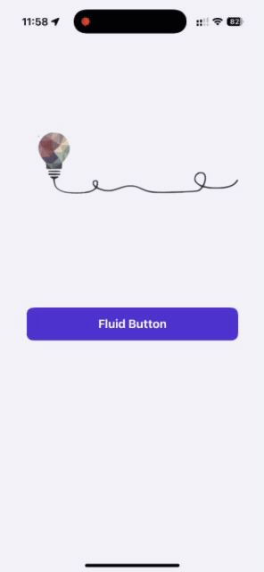

# Fluid Button Custom Componnet
An example of a custom button component with an interesting animation that transforms the button from a regular shape into a custom path on a long press, with changes to color, font, shadow, and other effects.
Developed entirely natively using Swift and SwiftUI.

## Installation
All dependencies are managed by SPM automatically.

## Build
No additional setup is needed. Build project using Xcode.

## Technologies
* Swift
* SwiftUI

## Versions
* Xcode 16.0 (latest)
* Swift 6.0 (latest)

## Branches
GitFlow is strictly enforced on this repository. [GitFlow](https://www.atlassian.com/git/tutorials/comparing-workflows/gitflow-workflow)

### Branch overview
* master
* develop
* feature/name
* hotfix/name

### Git Flow:
feature -> develop -> master

## License
Copyright © February 15, 2025 Konstantin Stolyarenko. All rights reserved.
